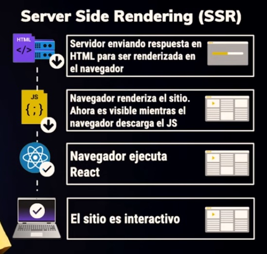

# Server Side Rendering(SSR) - Express.js
## Client Side Rendering(CSR)
Antes de empezar con SSR es bueno entender como funciona el CSR

Cuando hacemos una petición a nuestro servidor
* tenemos que esperar que este responda con nuestro html
* cargue nuestro código javascript
* ejecutarlo para que llegue a ser **visible** e **interactivo**

El CSR se usa principalmente para rutas privadas o que no van a ser visibles para todo el público

## Server Side Rendering(SSR)

Cuando hacemos una petición a nuestro servidor
* Esperamos a que este responda con nuestro html
* El navegador renderiza nuestro html por lo que ya es **visible**
* mientras que en paralelo carga nuestro código javascript
* Por lo que nuestro sitio sera visible mucho antes sin tener que esperar a que se ejecute nuestro js
* termina la ejecucion de nuestro js
* nuestro sitio ya es **interactivo**

El SSR se usa cuando nuestro sitio tiene que ser visible, si queremos que nuestro sitio sea indexado(google) y para garantiar la UX de nuestro sitio en cualquier lado y para cualquiero usuario

## ¿Por qué renderizar desde el servidor?
* Primera cargar más rápida
* Mejor SEO
* Look & Feel